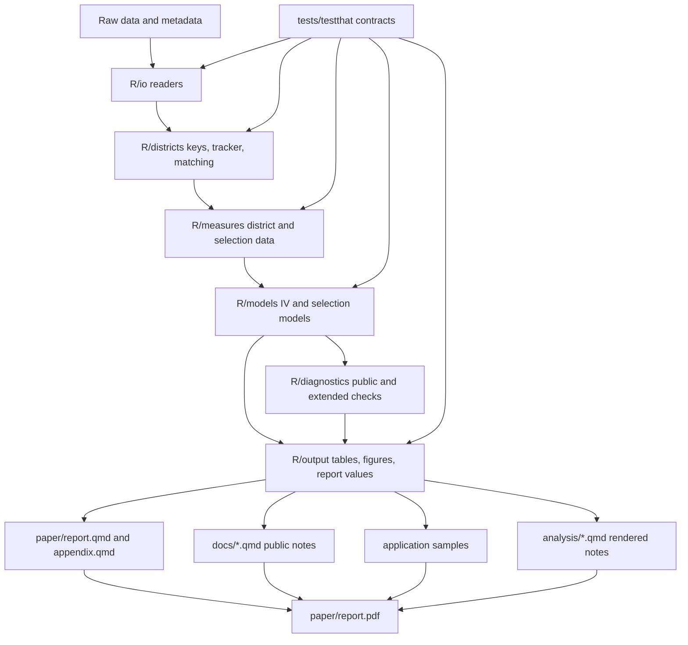

# Architecture

This is a living document. Update it whenever the codebase’s structure, pipeline contracts, public outputs, or contribution rules change. Its goal is to help future contributors and agents understand the project quickly enough to make safe, well-scoped changes from day one.

## Purpose

This repository builds the English-medium instruction and inequality paper, supporting diagnostics, application samples, and replication artifacts. The active codebase is current-source-first: edit current R modules, current QMDs, tests, and documentation directly. Historical refactor evidence lives under `archive/refactoring/` and should not drive active builds.

## Project Structure

- `_targets.R` — central pipeline definition. Describes the active data,
  diagnostics, table, figure, document, sample, and analysis-note targets.
- `R/` — source modules used by the pipeline.
  - `R/config.R` — configuration helpers.
  - `R/io/` — raw data readers and file/path handling.
  - `R/districts/` — district keys, tracker parsing, current harmonization,
    and the parallel district-lineage v2 source/bridge/matching modules.
  - `R/measures/` — construction of analysis measures and district panels.
  - `R/models/` — model estimation and IV formulas.
  - `R/selection/` — selection/probit sample construction and AMEs.
  - `R/diagnostics/` — public and extended diagnostics.
  - `R/benchmarking/` — optional benchmark targets.
  - `R/output/` — tables, figures, report values, public QMD helpers, and
    rendering helpers.
  - `R/application_samples/` — writing/coding sample extraction and rendering.
- `paper/` — current paper sources and rendered paper outputs.
  - `paper/report.qmd` — main paper source.
  - `paper/appendix.qmd` — appendix source.
  - `paper/references.bib` — bibliography used by public QMDs.
- `docs/` — public notes, project documentation, and architecture docs.
  - `docs/district-matching.qmd` — current district matching/spatial note.
  - `docs/long-paths-and-8-3-filenames.qmd` — replication technical note.
  - `docs/ARCHITECTURE.md` — this document.
- `analysis/` — rendered analysis notebooks and their QMD sources. These
  support diagnostics and benchmarks; prose-preservation tests may apply.
- `outputs/` — generated current outputs used by papers, docs, diagnostics,
  and analysis notes.
  - `outputs/tables/main/`
  - `outputs/figures/main/`
  - `outputs/diagnostics/public/`
  - `outputs/diagnostics/extended/`
  - `outputs/benchmarking/`
- `application-samples/` — rendered application writing/coding samples.
- `scripts/` — command-line audit/check/render helpers.
- `tests/testthat/` — unit and contract tests.
- `archive/refactoring/` — historical proof and one-off migration scripts from
  the completed refactor. Do not use this archive as active build machinery.

## System Diagram

## Data Flow

1. Raw files and metadata are read through `R/io/`.
2. District source names, tracker records, boundaries, manual corrections, and
   harmonized keys are built in `R/districts/`. The reviewed wide crosswalk
   remains the production authority while the v2 lineage diagnostic builds
   code-based Census registries, SHRUG transition weights, LGD subdistrict and
   urban-coverage registries, source-match candidates, and administrative-event
   review queues in parallel.
3. Analysis-ready measures and panels are built in `R/measures/`.
4. Estimation happens in `R/models/` and `R/selection/`.
5. Public diagnostics and optional diagnostics/benchmarks are built in
   `R/diagnostics/` and `R/benchmarking/`.
6. Tables, figures, named report values, public QMD helpers, and render helpers
   live in `R/output/`.
7. Current QMDs in `paper/`, `docs/`, and `analysis/` consume target-backed
   outputs. They are not regenerated from legacy sources.
8. Tests check both low-level functions and high-level output contracts.

## Layering Rules

* `_targets.R` orchestrates; it should not contain heavy data manipulation.
* `R/io/` reads and normalizes inputs; it should not estimate models.
* `R/districts/` owns district harmonization and matching.
* `R/measures/` owns analysis-ready measures and panels.
* `R/models/` and `R/selection/` own estimation logic.
* `R/output/` owns presentation outputs, report values, and rendering helpers.
* `paper/` and `docs/` QMDs should contain prose and small rendering calls, not
  large reusable helper functions.
* `scripts/` should orchestrate checks and audits, not duplicate core R logic.
* `archive/refactoring/` is historical. Active code must not depend on it.

## District-lineage migration rule

The current production panel and the lineage-v2 rebuild are intentionally
separate. `data/metadata/district_harmonization_crosswalk.csv` remains the
production authority until the v2 ledgers are fully adjudicated. The v2 modules
must not silently promote fuzzy candidates or unknown LGD modifications into
production. Their durable interfaces are compact tracked metadata tables plus
CSV diagnostics under `outputs/diagnostics/extended/district_lineage_v2/`.
Production migration requires unique 2001 IDs, valid source-date identities,
allocation weights summing to one, documented exclusions, and no unresolved
production match.

## Updating This Document

Update this file when:

* directories or major modules are added, moved, renamed, or removed;
* target groups or public output contracts change;
* QMD rendering or report-value conventions change;
* tests begin enforcing a new architectural rule;
* old refactor-era compatibility code is archived or deleted;
* major modeling, district-matching, diagnostic, or output layers change.

Prefer concise updates. Do not duplicate function-level documentation or the
full replication guide.

## Build Philosophy

`{targets}` is the source of build truth. Add durable computation as functions used by targets, and add generated public artifacts as explicit file targets when later steps read them from disk. Avoid untracked side effects: if a QMD, diagnostic, or check reads a generated CSV, PDF, HTML, or Markdown file, that file should be produced by a target or by a documented render/check script.

Keep orchestration thin. `_targets.R`, Makefile targets, and scripts should coordinate work; reusable logic should live in `R/` modules with tests. Public QMDs should contain prose and small rendering calls, not large helper implementations.

Use tests as architecture guards. Unit tests should cover low-level behavior, while contract tests should protect public output structure, required artifacts, report-value keys, and retired build machinery.
## District-lineage migration boundary

The existing reviewed crosswalk remains the production authority. The parallel lineage-v2 modules under `R/districts/lineage_v2_*` and `R/diagnostics/diagnose_district_lineage_v2.R` ingest candidate sources, build Census registries and a SHRID bridge, generate review candidates, and evaluate migration gates. They must not alter the paper panel until tracked adjudications are complete. See [`docs/DISTRICT_LINEAGE_V2.md`](DISTRICT_LINEAGE_V2.md) for source authority, statistical rules, invariants, and the ordered work plan.
