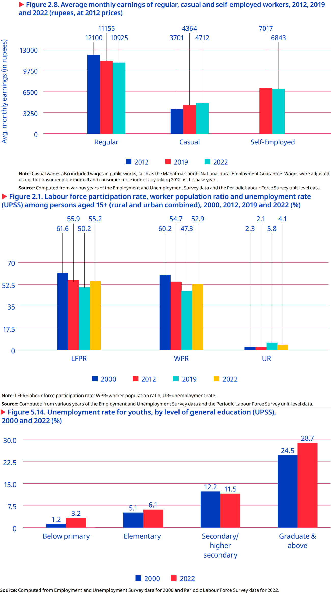
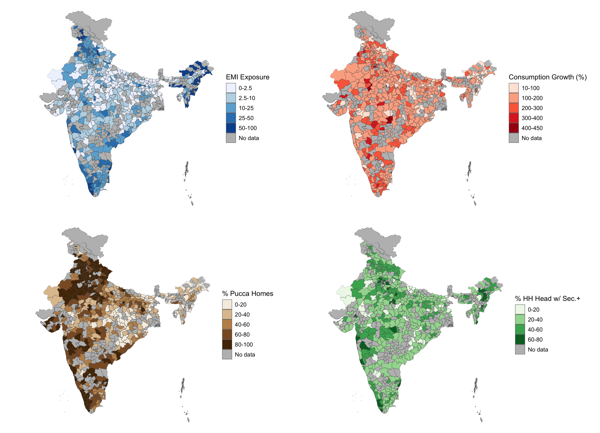
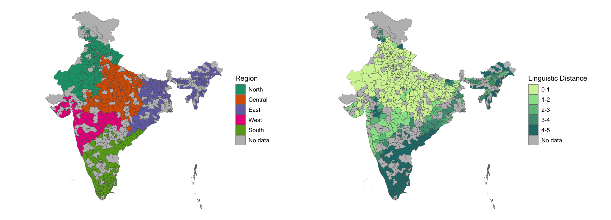
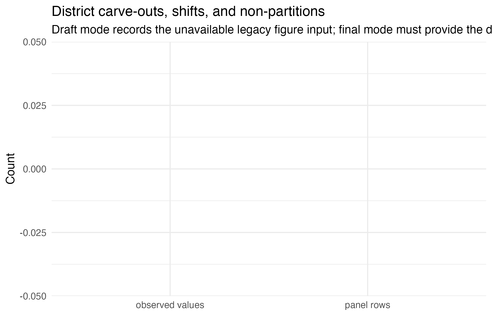

```{r report-target-values, include=FALSE}
find_targets_store <- function(start = getwd()) {
  here <- normalizePath(start, mustWork = TRUE)
  repeat {
    candidate <- file.path(here, "_targets")
    if (dir.exists(candidate)) return(candidate)
    parent <- dirname(here)
    if (identical(parent, here)) return("_targets")
    here <- parent
  }
}
report_values <- tryCatch(targets::tar_read(report_values, store = find_targets_store()), error = function(e) list())
report_output_files <- tryCatch(c(targets::tar_read(figure_files, store = find_targets_store()), targets::tar_read(table_files, store = find_targets_store())), error = function(e) character())
if (is.null(report_values) || !is.list(report_values)) report_values <- list()
legacy_inline_expressions <- list(
  inline_391c516e = "edu0708b4 %>% filter(RELATION_TO_HEAD==1 & SEX==1) %>% summarise(round(mean(AGE),1)) %>% .[[1]]",
  inline_502254b6 = "edu0708b4 %>% filter(RELATION_TO_HEAD==3 & SEX==1) %>% summarise(round(mean(AGE),1)) %>% .[[1]]",
  inline_101aa68e = "edu0708b4 %>% filter(RELATION_TO_HEAD==7 & SEX==1) %>% summarise(round(mean(AGE),1)) %>% .[[1]]",
  inline_4ba2ef54 = "edu0708b4 %>% filter(RELATION_TO_HEAD==2 & SEX==1) %>% summarise(round(mean(AGE),1)) %>% .[[1]]",
  inline_7b41b8b0 = "edu0708b4 %>% filter(RELATION_TO_HEAD==2 & SEX==1) %>% summarise(round(mean(AGE<=17),3)) %>% .[[1]]",
  inline_a5aa43ec = "edu0708b4 %>% filter(RELATION_TO_HEAD==5 & SEX==1) %>% summarise(round(mean(AGE),1)) %>% .[[1]]",
  inline_5aa491ab = "mfx_df %>% filter(term==\"AGE\") %>% pull(estimate) %>% round(3)",
  inline_7f5360c6 = "mfx_df %>% filter(term==\"AGE\") %>% pull(estimate) %>% round(3) %>% abs()*100",
  inline_9cd11971 = "mfx_df %>% filter(term==\"RELIGION\" & grepl(\"Muslim\",contrast)) %>% pull(estimate) %>% round(3)",
  inline_dee45a99 = "mfx_df %>% filter(term==\"AGE\") %>% pull(estimate) %>% round(3)*100",
  inline_b833e95b = "mfx_df %>% filter(term==\"SEX\") %>% pull(estimate) %>% round(3)*100",
  inline_eb012827 = "mfx_df %>% filter(term==\"HH_SIZE\") %>% pull(estimate) %>% round(3)*100",
  inline_a3fcb577 = "mfx_df %>% filter(term==\"RELIGION\" & grepl(\"Muslim\", contrast)) %>% pull(estimate) %>% round(3)*100",
  inline_dfcb22a5 = "mfx_df %>% filter(term==\"SOCIAL_GROUP\" & grepl(\"Tribe\", contrast)) %>% pull(estimate) %>% round(3)*100",
  inline_55014f4e = "mfx_df %>% filter(grepl(\"dmean_num\", term) & grepl(\"RECD_TXT_BOOKS\", term)) %>% pull(s.value) %>% signif(3)",
  inline_7d871500 = "kappa %>% format(scientific = FALSE, digits = 7)",
  inline_d306ea57 = "partial_f %>% round(digits = 2)",
  inline_c0673df9 = "partial_p %>% signif(digits = 2)",
  inline_a07dddc1 = "summary(first_stage_consumption, vcov = vcov_first_stage_consumption)$coefficients[\"wavg_ling_degrees\",1] %>% round(2)",
  inline_4f1d6a5b = "summary(first_stage_consumption, vcov = vcov_first_stage_consumption)$coefficients[\"gini_cons_0708\",1] %>% round(2)",
  inline_97bf1523 = "summary(model_consumption_iv, vcov = vcov_model_consumption_iv)$coefficients[\"EMIE\",4] %>% round(digits = 2)",
  inline_07c03c06 = "summary(model_consumption_iv, vcov = vcov_model_consumption_iv)$coefficients[\"EMIE\",1] %>% round(digits = 2)",
  inline_19ced62f = "summary(model_consumption_iv, vcov = vcov_model_consumption_iv)$coefficients[\"pct_urban\",1] %>% round(digits = 2)",
  inline_98e93a71 = "summary(model_consumption_iv, vcov = vcov_model_consumption_iv)$coefficients[\"pct_urban\",4] %>% round(digits = 3)",
  inline_178b6738 = "summary(model_consumption_iv, vcov = vcov_model_consumption_iv)$coefficients[\"pct_head_secondary_plus\",1] %>% round(digits = 2)",
  inline_8a7afce3 = "summary(model_consumption_iv, vcov = vcov_model_consumption_iv)$coefficients[\"pct_head_secondary_plus\",4] %>% round(digits = 3)",
  inline_56755d09 = "summary(model_consumption_iv, vcov = vcov_model_consumption_iv)$coefficients[\"pct_muslim\",\"Estimate\"] %>% round(digits=3)",
  inline_4c904f9e = "summary(model_consumption_iv, vcov = vcov_model_consumption_iv)$coefficients[\"pct_st\",\"Estimate\"] %>% round(digits=3)",
  inline_f7e3ad2c = "summary(model_consumption_iv, vcov = vcov_model_consumption_iv)$coefficients[\"pct_obc\",\"Estimate\"] %>% round(digits=3)",
  inline_cd5afd77 = "summary(model_consumption_iv, vcov = vcov_model_consumption_iv)$coefficients[\"pct_medium_land\",4] %>% round(digits = 3)",
  inline_861e7564 = "summary(model_consumption_iv, vcov = vcov_model_consumption_iv)$coefficients[\"pct_large_land\",4] %>% round(digits = 3)",
  inline_46353c81 = "summary(model_consumption_iv, vcov = vcov_model_consumption_iv)$coefficients[\"gini_cons_0708\",4] %>% round(digits = 3)",
  inline_0b52593f = "summary(model_consumption_iv, vcov = vcov_model_consumption_iv)$coefficients[\"pct_fem_head\",4] %>% round(digits = 3)"
)
is_report_value_status <- function(value) {
  is.list(value) && !is.null(value$status) && !is.null(value$reason)
}
report_value <- function(key) {
  value <- report_values[[key]]
  if (is.null(value)) value <- report_values[[legacy_inline_expressions[[key]]]]
  if (is.null(value)) value <- NA
  if (is_report_value_status(value)) {
    display <- value$value
    if (is.null(display) || length(display) == 0L || all(is.na(display))) display <- value$display
    if (is.null(display) || length(display) == 0L || all(is.na(display))) display <- "—"
    value <- display
  }
  if (length(value) == 0L || all(is.na(value))) return("—")
  paste(value, collapse = ", ")
}
```

::: {.sample-excerpt #ws-intro-question-contribution sets="writing-5pg writing-10pg" order="1"}
# Introduction and Literature Review {#sec-intro}

The Indian economy presents a series of paradoxes. The same economy whose GDP has grown at 6% annually on average for decades [@organization2024a, p. 2] has also seen stagnation if not losses in wages, employment, and labor force participation (see Figure @fig-ILO-fig), all while higher education has continued to develop an extremely strong, positive correlation with higher youth *unemployment*.^[Note that lower levels of education are instead strongly correlated with youth *under*employment [@organization2024a, p. 130]. There are no winners here.] And though the International Labour Organization (ILO) traces this back to a labor supply which lacks the skills needed to fill available job openings (p. 174), high unemployment rates can be found for skilled laborers of all backgrounds, including those who received vocational education and training [@agrawal.agrawal2017].

{#fig-ILO-fig}


Appreciating this broader view helps reveal the degree to which unemployment, underemployment, and "jobless growth" [@graddol2010a] have, alongside wealth inequality, combined to undermine the degree to which many benefit from India's recent economic growth [@bharti.etal2024]. From here we adopt a bottom-up perspective---what can members of this "many" do to improve their lives in such a context?---and in doing so, our motivating question reveals itself to be two-fold: 1) If I am a household, what can I do to best ensure my children's future success in this context? And 2) if I am a local policy-maker, what can I do to best ensure my constituents' future welfare in this context?


The history of economics highlights *education* as one rich answer to these questions [@mincer1974; @card1999; @bjorklund.kjellstrom2002; @bhandari.bordoloi2006]. The history of India, however, highlights another: *English*. In its capacity as global lingua franca [@melitz2016], English is perceived as expanding mobility [@itaniMeaningLanguageSkills2015] and opening pathways to education at prestigious universities and jobs at wealthy multinational corporations across the world [@ramanathanTeacherKnowledgeBase2014], particularly in the US [@bediEnglishLanguageIndia2019, pp. 32-33]. But combine this with its role as domestic lingua franca [@clingingsmithIndustrializationBilingualismIndia2014], and we see the number of intranational pathways English opens up as well: the mass off-shoring of millions of service jobs in the 1990s and the rise of information technology (IT) since have not only driven a rapid rise in India's GDP, but also a flurry of jobs whose higher socioeconomic returns [@chamarbagwala.sharma2011; @smokotin2014a] are in large part only accessible to those who speak English [@mankiw.swagel2006; @shastry2012a]. 

Empirical study reveals the combined effect of these mechanisms. Using nationally-representative, household-level panel data, @azam2013a find that English fluency was, at least up until 2005, associated with a 34% hourly wage premium for men and a 22% premium for women; even for men and women with little English proficiency, the premia were still 13% and 10%. @refeque2022a would later replicate this finding and extend it out to 2011-12. The strongest evidence for a causal effect of English skills on wages, however, comes from @chakraborty2016a, for whom West Bengal's 1983-2004 ban on English teaching in public primary schools constituted a natural experiment whose treatment group (those with increased "exposure" to the ban) faced a 26% decrease in future weekly wages relative to the control group (those less "exposed" to the ban)^[We will return to "exposure" again in Sec. @sec-iv-model].

It is thus by combining our two answers---education and English---that we can begin to understand the demand for *English-medium instruction (EMI)*, or for the teaching of all school subjects in English, currently seen in India [@gooptu2023a; @lahoti2019a; @chattopadhayLowFeePrivateSchools2017]. "Language skills are human capital," after all [@chiswick1995a, p. 4], and "English-language skills [specifically] are a form of human capital" [@azam2013a, p. 344]; if the main mechanism by which education affects wages is human capital, then synthesizing education with English like this seems natural. Perhaps this is why EMI, as both a tool for social development [@commission2009a] and even as a tool for individual liberation,^[Particularly from caste and the intergenerationally-rigid distributions of wage, employment, and occupation it enforces, as studied by @madheswaran.singhari2016 and @munshi2006a. See @mathur2013a and @mathew2011a for their advocation of, as well as @vij2020a for their polemic for, EMI as a means of upwards growth.] is so often seen as a source of hope.

But the truth of EMI remains unclear and understudied. On one hand, there are limitations unique to EMI: instruction in one's mother tongue is associated with better academic participation and outcomes, both within India [@mohanty2022a; @nair2015a] and beyond [@buehmann2009a], particularly when schooling quality and parents' socioeconomic status are controlled for.^[ The key mechanism here appears to be the effect of exposure to a language at home on a child's ability to learn the language [@nair2015a; @erlingMediumInstructionPolicies2016]. The dissimilarity between the languages spoken at home and the colonial languages chosen as lingua franca and media of instruction across the extremely linguistically diverse sub-Saharan Africa helps explain, per @laitin2022a, the low rates of absolute learning and thus low rates of development in the region. Another potential mechanism, once hotly debated, is that childhood bilingualism generally confuses children, and that they most effectively learn with only one language while young [@hakutaChapter2Bilingualism1986]. The true effects of such bilingualism, however, seem to be much more nuanced; see @bialystokBilingualismConsequencesMind2012 for a review and for the effects of bilingualism into adulthood and old age.] 


On the other hand, there are limitations unique to the many flaws of the Indian education system: low-effort [@singh2013], even abusive [@centreforbudgetandpolicystudies2020, pp. 218-22] teachers whose annual absenteeism rates have remained near 25% for decades [@muralidharan.etal2017; @chaudhury.etal2006, who also find that only 45% of teachers at any one point in time were engaged in any kind of teaching-related activity]^[The long-term consistency of this trend reflects the longevity of the civil service protections which produce it: limits on teacher hiring/firing power in government schools enable qualified teachers to extract such rents [@chaudhury.etal2006]. Even when rarely-absent teachers rationally advocate for such protections, they end up further deepening the culture of absence which @basu2006 finds to explain the significant state-by-state heterogeneity in teacher absenteeism rates. The simple act of increasing the frequency of teacher monitoring, however, is enough to drastically reduce absenteeism [@kremer.etal2005; @muralidharan.etal2017].] coupled with inefficient resource allocation [@muralidharanContractTeachersExperimental2013; @gooptu2023a] and poor commuting infrastructure [@kremer.etal2005], all alongside schools which actively lie about their medium of instruction [@mathew2011a; @lahoti2019a], all of which is more commonly found in government schools than private. And yet the mismatch between expectation and reality can be so great that, even among the rural *private* schools surveyed by @lahoti2019a, "more than half (57%) of the children who [were] supposed to be [in EMI were] actually studying in the dominant regional language" (p. 55). Navigating such an environment requires parents to have enough information and social capital with which to identify higher-quality schooling/tutoring^[The best evidence for this comes from @andrabiReportCardsImpact2017 and @afridiImprovingLearningOutcomes2020, whose experimental treatments of education information provisioned to parents led to a more efficient market and improved student outcomes, particularly in the private schools nudged to improve quality by the treatment.]---often the product of being well-educated themselves [@lahoti2019a; @blimpo.etal2015]---but also to have a high enough income to afford this higher-quality^[Which in practice often equals private schooling; see @tooleySchoolChoiceAcademic2011.] education [@muralidharan2008a; @singh2013].

The demand for both higher-quality education in general and EMI in particular has, since at least the 2000s, been increasingly met by a supply of 'low-cost'^['Low cost' may be a misnomer: poor households in the Delhi National Capital who sent their children to private school did so at the expense of 7-20% of their monthly incomes [@endow2019a].] private schools [@jamesChoosingChangingSchools2014; @srivastavaLowFeePrivateSchooling2013; @ramanathan2016a; @chattopadhayLowFeePrivateSchools2017].^[The demand for higher quality education almost always takes precedence over the demand for EMI, however. In 2014, for example, @joshiUnderstandingConsumerDemographics2017 show that 76% of households who chose private education did so for either a "better environment of learning" or to get a better education than a government school. Only 15.4%, however, listed EMI. Still, aside from private schooling, EMI seems to be the most frequently used proxy for high quality education] Such schools lack the reputation typically afforded to higher-end private schools, meaning their students lack the social capital of other private school students [@ramanathan2016a]. Conversely, more disadvantaged students are priced out of all schools except the free [if not negatively priced, see @muralidharan2019a] government schools. Note that these schools are not only associated with a lower quality of education [@muralidharan2008a; @srivastavaLowFeePrivateSchooling2013; @muralidharan2015a; @rajuPrivateSchoolingIndia2023], they are also associated with the most obvious signals of education quality, visible even to low-information parents, being worse-off e.g., worse facilities [@srivastavaLowFeePrivateSchooling2013; @foundation2020a, p. 54]. Here we have evidence that school search ends with an inequality-amplifying positive assortative matching [@muralidharan2019a]. Yet even amongst this new 'middle class' of schools, issues with EMI persist: the survey of @lahoti2019a and the ethnographic study of @bhattacharyaMediatingInequalitiesExploring2013 find children in low-cost private schools failing to learn both English as well as the subjects taught in it, further corroboration of the findings of @buehmann2009a, @nair2015a, and @mohanty2022a. The reasons for this are likely two-fold: compared to parents who enroll their children in high-end private schools, those who select into low-cost private schools are typically 1) lacking in information and social capital, thus "[making] misguided evaluations of school quality based on visible factors" [@muralidharan2015a, pp. 1061-1062]; and 2) do not provide their children with as much community and out-of-classroom support for English (particularly when compared to "elite families" who often use English as a second language even within the family [@guptaColonisationMigrationFunctions1997, pp. 54-55]), preventing their oral skills from developing to the point where they can engage in class beyond rote memorization of the teacher's answers [@bhattacharyaMediatingInequalitiesExploring2013; @treffers2022a], to the extent such engagement is allowed [@brinkmannLearnercentredEducationReforms2015].^[It's worth noting our exclusion of the results from @muralidharan2015a, despite it being a particularly noteworthy paper on the limitations of private schooling. By studying a randomized controlled trial of a private EMI voucher experiment, they discover that private schools did *not* lead to improvements in educational outcomes (although they did significantly lower cost). @tooleyExtendingAccessLowcost2016, however, points out that this result may be driven by the fact that instructions for non-language subject exams were given in Telugu for government schools and English for private schools. He then finds "suggestive" evidence of what results would look like if all children took the same test (p. 580), and from there demonstrates a large, statistically significant advantage for private education.]


Given all these mediators, nuances, and negations of its perceived effect, can EMI truly be seen as a source of hope? Should households turn to it to invest in their children's future? Does greater enrollment in EMI aid future development? Should policy-makers be promoting it as a tool for local development? To gain insight into these questions, we seek to answer the following one:
\begin{quote}
What is the effect of exposure to English-medium instruction enrollment in 2007-08 on the growth of local consumption from 2007-08 to 2017-18?
\end{quote}
First, note the improvements made here over the previous literature. The setting of 2007-2018 may be more relevant today than the settings of similar literature, all of which are closer to the advent of service job offshoring in the 1990s [e.g., @refeque2022a]. Additionally, note that our response variable here is consumption, not wages. India holds a vast number of informal and self-employed individuals, meaning its labor force varies wildly in the degree to which wages reflect material well-being.^[See @shrivastavInformalityIndianLabour2026a and @bahlInformalityEducationoccupationMismatch2024 for the frequency and wage effects of informality respectively. Wages may still be more responsive to EMI in the medium-run window we study, however. See Sec. @sec-alty for more.]

Second, we must highlight that unlike much of this literature, we lack household panel data. We will thus follow previous papers [e.g., @martinBigOutSmall2017] and aggregate data at the district level.^[A district in India is akin to a county in the United States, but with an average population of 2 million. Table @tbl-sum-tbl-iv contains more information on district populations.] More specifically, we will take cross-sectional data from 2007-08 [@nationalsamplesurveyoffice2008] and 2017-18 [@office2022a], aggregate each at the district level separately, and match districts across the time periods to construct a district pseudo-panel. District-level variables are developed in Sec. @sec-iv-model and the district matching method is explained in Sec. @sec-distma-spa .

Our empirical methodology will then proceed in two parts. In Sec. @sec-heckman, we study the composition of our key "EMI exposure" measure by estimating an individual-level probit of school participation in 2007-08. In Sec. @sec-iv, we move to the district level and implement two-stage least squares (2SLS): the weighted average of linguistic distance from Hindi in 2001 will be used to instrument for EMI exposure, onto whose fitted values we regress the growth rate of average consumption.^[Future work may incorporate both education selection and EMI exposure as endogenous regressors in a first-difference (FD) 2SLS design. The district-level aggregates of Table @tbl-sum-tbl-probit-quant may be able to function as education supply-shifting instruments.] The choice of instrument is discussed in Sec. @sec-iv-iv.

Our 2SLS results will, at best, reflect the medium-run local general equilibrium effects of EMI exposure. On one hand, by aggregating away all individual or household-level variation, the ecological fallacy renders our 2SLS estimates uninterpretable at these lower levels. Additionally, school-going children in 2007-08 will still be quite young in 2017-18, and many may still be in school (particularly in more developed districts).^[Cohort-specific measures of EMI exposure may thus be incorporated into future drafts, as may robustness checks that use school-reported data on medium of instruction to construct EMI exposure---with the aforementioned caveat that schools may lie about having EMI [@mathew2011a; @lahoti2019a]. Such surveys may also reveal whether EMI exposure is rigid over time. If so, this could allow us to expand the window of time over which we can interpret our results. Rigidity could also rule out the agglomeration of EMI discussed in Sec. @sec-disc as a potential attenuating force behind our results.]

With our current methodology, we find that greater exposure to EMI enrollment has a statistically and economically *insignificant* effect on local consumption growth (Sec. @sec-disc), in line with previous literature on EMI and Indian education quality. Note, however, that our outcome includes households not directly exposed to EMI, meaning the effect we're studying would likely be inherently small regardless. Migration and spatial spillovers may also attenuate our results; evidence which both challenges and supports this is discussed in detail in Sec. @sec-spa).


:::

# Data Sources {#sec-data}

The sole 2001 variable, linguistic distance from Hindi, comes from the 2001 Census of India [@officeoftheregistrargeneralandcensuscommissionerofindiaCensusIndia20012001]. 

Geospatial data intended for maps and spatial autocorrelation measures is sourced from @bhatiaMergingUpdatedDistrictlevel2020, which is itself an adaptation of @meyersIndiaOfficialBoundaries2020. The active figures below use district-level empirical distributions while the geometry join remains under validation. Our methods for tracking districts across time (see Sec. @sec-distma) begin with data from @indiastatestoriesDistrictEvolution2024 and @jaacksIndiaDistrictChanges2020.

All variables reflecting 2017-18 data come from the 75th Round of the National Sample Survey (NSS), titled "Household Social Consumption: Education" [@office2022a]. All 2007-08 variables but one come from the 64th round of the NSS, on "Participation and Expenditure in Education" [@nationalsamplesurveyoffice2008]; the sole exception to this is the percentage of homes which are pucca (i.e., permanent), which is instead sourced from a separate schedule of the 64th NSS, “Household Consumer Expenditure” [@nationalstatisticalofficeIndiaHouseholdConsumer2011]. Response rates in all of the surveys were above 96%. 

Sample weights were applied wherever applicable. All district-level aggregates were formed as sample-weighted averages. The education participation probit of Sec. @sec-heckman used survey-weighted generalized linear models and design-based standard errors.^[Clusters were formed at the primary sampling unit, which were rural villages and urban blocks. These clusters were nested, or defined within, substrata which were themselves nested within strata. (Strata generally corresponded to districts, whereas substrata generally corresponded to each side of the rural/urban partition of the district. Multiple urban substrata were allowed for particularly dense areas, with the largest number of substrata within a district being 29.) All were accounted for in the probit.]. Summary statistics for variables used in the probit are given in Tables @tbl-sum-tbl-probit-quant and @tbl-sum-tbl-probit-cat, whereas Table @tbl-sum-tbl-iv contains summary statistics for variables used in the 2SLS estimation. 

Except for certain individual-level variables in the education probit, we will be aggregating variables at the district level. As will be shown in Table @tbl-sum-tbl-iv, the average population of a district in either sample period (2007-08 and 2017-18) is 2 million. In the survey samples, however, most districts have between 400 and 1200 people represented in the data, with the exact number varying in line with a district's population.

```{r}
#| label: tbl-sum-tbl-iv
#| tbl-cap: "Summary statistics for 2SLS model variables"
#| echo: false
output_table <- function(path) {
  if (file.exists(path)) return(utils::read.csv(path, check.names = FALSE))
  data.frame(status = "missing generated output", path = path)
}
knitr::kable(output_table("../outputs/tables/main/sum_tbl_iv.csv"), digits = 3)
```


## Data Issues: Representativeness and Quality

Despite the complicated methodology and rigor underlying each NSS round [see, e.g., @mahalanobisNationalSampleSurvey1954], three key issues with NSS data still exist. We address them in increasing order of severity.

The first issue is the observation from @deolalikarNationalSampleSurvey2008 that "the NSS has sometimes changed its data collection methodology midstream, and this has affected the comparability of NSS estimates over time" (p. 410). The examples they and the @ministryofstatisticsandprogramimplementationRecentRounds2024 mention predate all of our data, whereas the change described by the @ministryofstatisticsandprogramimplementationRecentRounds2024 (that the base year for calculating national accounts has shifted from 2004-05 to 2011-12) should be mostly irrelevant for us. More relevant, however, is the politicization of the NSS documented by @bhattacharyaIndiasStatisticalSystem2023, which may affect our 2017-18 measures: Bhattacharya begins this period of NSS history by describing a major revision to GDP figures in 2014-15 which was generally misaligned with most other economic indicators. Making this even more suspicious, however, was the state's unwillingness to reveal any information on the reasons or methodology behind this change. Revelations of ghost firms in the NSS database used to calculate the new GDP series, plus a leak of poor unemployment data in 2017-18 which was not officially released until after the Lok Sabha election in 2019, hurt the trustworthiness of our data; @subramanianIndiasGDPMisestimation2019 ultimately finds that, driven by an improper use of value-added vs. volume metrics, informal activity proxies, and deflators within industries, the NSS Office had overestimated GDP growth rates by 2.5 percentage points.

More worrying is the observation by @lucasImpermanenceMovesReturn2021 that "the NSS is not representative at the district level" (p. 329). While Lucas does not provide a citation for this, it still may be true. @samratInformingPolicyInspiring writes about a conference on Oct. 9th, 2025 where the National Statistics Office had touted its ability to, among other things, provide district-level estimates; the language is unclear on whether this means district-level estimates will now be provided in NSS reports or that district-level estimates can now be meaningfully calculated from NSS data. Documentation from the @nationalsamplesurveyorganisationConceptsDefinitionsUsed2001 states that NSS sampling is built "in order to ensure proportionate representation or pre-fixed numbers of sample households from each group / stratum," which we henceforth use synonymously (p. 15). Defining proportionate representation at the stratum level has been an NSS tradition since @mahalanobisNationalSampleSurvey1954 [pp. 274-276], but the benefit of the NSS rounds that we use is that strata are now defined within sectors, or the rural and urban areas of each district (with multiple urban sectors if population density is high). 

Consider @nationalsamplesurveyoffice2008, the source of most of our 2007-08 measures. Its sampling begins at the national level, where the total number of first-stage units (FSUs) is set, each FSU corresponding to a village or Panchayat ward in rural areas, or a block or a town/outgrowth (OG) in urban areas. These FSUs are then allocated in proportion to population in the following order: first, between the rural vs. urban sectors of the state, with a slight weight to urban; then to strata; then sub-stratum; and from there, FSUs are selected. In rural areas, selection was done using Probability Proportional to Size With Replacement (PPSWR), with the size being the population in the 2001 census. Simple Random Sampling Without Replacement (SRSWOR) was used for urban areas where FSUs were blocks, and PPSWR (with weights from the 2001 census) was used where FSUs were towns/OGs. The documentation for @office2022a, the source of our 2017-18 measures, makes it clear that FSUs are allocated first to state, then to within-state region (a more recent addition), then to districts, strata, sub-strata, sub-rounds, sub-samples, and FOD sub-regions. 

Even then, if each district gets rural and urban sectors, and if sample FSUs are selected from within each, it's possible to make the claim that district-level estimates are representative; if samples within strict subsets of the district are representative, why should districts not be able to inherit that?

Where representativeness at the district-level could fall apart, however, is in FSU selection. Four FSUs are selected from each sub-stratum, so if a district has only one sub‐stratum, then only four FSUs may be selected in that district. Additionally, the use of PPSWR (with replacement) in rural strata or for town/OG FSUs means that the same FSU might theoretically be selected more than once [@brusChapter7Twostage2023]. The design may thus be sufficient for producing reliable state-level estimates, and perhaps even for major districts; but it may be weak for smaller districts with low sample sizes.

Finally we have the most difficult issue to address: general data quality issues. The response rate to NSS surveys systematically decreases in a household's wealth and income, helping ensure endogeneity and bias behind what was reported and what was not
[@raviOurNationalSurveys2023]. For surveys which use the 2011 census as their sampling frame (which includes our 2017-18 data), meanwhile, all of the rural, working age (15-29), and SC (Scheduled Caste) populations were found to have been overestimated significantly. Contrasting 2011-12 econometric values with nation-wide shares from the 2011 Census, @raviAssessingNationalSurveys2023 find that a sample size of 464,960 becomes a bias-adjusted sample size^["Intuitively, the bias-adjusted sample size is the size of the simple random sample that would have generated the same mean squared error" [@raviAssessingNationalSurveys2023, p. 3]] of 324, 240, or 536 given rural, SC, and working age overestimation respectively. This is a 99.9% reduction in statistical efficiency across the board [@raviAssessingNationalSurveys2023, p. 11].


::: {.sample-excerpt #ws-selection-model-missingness sets="writing-10pg" order="2"}
# The Composition of Education Participation {#sec-heckman}
## Model and Variables {#sec-heckman-model}
We are interested in how consumption growth is affected by EMI exposure (EMIE), which akin to previous literature [@chakraborty2016a] we define like so:
$$\text{EMIE}_d = 100\times\frac{\text{Num.  children enrolled in EMI}}{\text{Num. children enrolled in school}}\,\,\, \text{in district }d$$
This measure is effectively a district-level reflection of an intensive margin. To complement our understanding of EMIE in later sections, we would like to understand the extensive margin---enrollment into school---and the variables which affect the probability that any one child $i$ (aged 5-19) appears in our EMIE measure. We thus estimate the following probit model:
\begin{align} \Pr\bigl(\mathrm{Enrolled}_i = 1 \mid X_i,\,Z_{d(i)}\bigr)
= \Phi\Bigl(
   \beta_0
 &+ \beta_1\,\mathrm{Age}_i
 + \beta_2\,\mathrm{Female}_i
 + \beta_3\,\mathrm{HH Size}_i
 + \beta_4\,\mathrm{Urban}_i
\notag\\[-0.0em]
&
 + \sum_{r\in R}\gamma_r\,\mathrm{Religion}_{ir}
 + \sum_{s\in S}\delta_s\,\mathrm{Social Group}_{is}
 + \sum_{d\in D}\theta_d\,\mathrm{SchoolDist}_{id}
\notag\\[-0.0em]
&
 + \sum_{f\in F}\psi_f,\mathrm{FatherEduc}_{if}
 + \sum_{u\in U}\eta_u\,\overline{u}_{d(i)}
 + \phi\,\overline{\mathrm{EnrollmentCost}}_{d(i)}
\Bigr)
\end{align}

\noindent where
$$
\begin{aligned}
R &= \{\text{Muslim, Christian, Sikh, Jain, Buddhist, Zoroastrian, None}\},\\
S &= \{\text{Scheduled Tribe, Scheduled Caste, OBC}\},\\
D &= \{\text{1–2km, 2–3km, 3–5km, $\ge5$km}\},\\
F &= \{\text{Illiterate; Literate, no school; Literate, school < primary;}\,\\
  &\quad\;\;\;\text{Primary, Upper primary, Secondary, Higher secondary, Postsecondary+}\},\\
U &= \{\text{Educ.\ free available},\,\text{Tuition waived},\,\text{Scholarship/Stipend},\,\\
  &\quad\;\;\;\text{Textbooks received},\,\text{Stationery received},\,\text{Mid-day meal, etc.}\}
\end{aligned}
$$

\noindent and
\begin{align*} \overline{u}_{d(i)} &= \text{Average value of } u \in U  \text{ in district } d \text{ amongst enrolled children, }\\
    \overline{\mathrm{Enrollment Cost}}_{d(i)} &= \text{Average value of } \mathrm{EnrollmentCost}  \text{ in } d \text{ amongst enrolled children.}
\end{align*}

There are two kinds of regressors here: those in $X_i$, the variables unique to child $i$, and $Z_{d(i)} = \{\overline{u}_{d(i)}:u\in U\} \cup\{\overline{\mathrm{EnrollmentCost}}_{d(i)}\},$ the variables which have been aggregated at the level of the district $d(i)$ where child $i$ lives. Without this aggregation, neither $u$ nor $\mathrm{EnrollmentCost}$, both endogenous to enrollment, would be well-defined for children not in school. Our aggregation can thus be understood as a way of handling missingness; whereas $\mathrm{EnrollmentCost}_i$ was missing for 120,062 children (as reflected in Table @tbl-sum-tbl-probit-quant), $\overline{\mathrm{EnrollmentCost}}_{d(i)}$ was missing for 7,109. Observations still missing a relevant variable were then dropped.^[Three such variables had missing values before dropping: the district-average $\overline{\mathrm{EnrollmentCost}}_{d(i)}$ (7109 missing values), the distance from the nearest primary class (312), and the father's education proxy (67). We find that none of these variables are MCAR (missing completely at random) under logistic regressions with missingness indiciators and adjusted $p$-values [per @benjaminiControllingFalseDiscovery1995]. The lowest McFadden pseudo $R^2$ among the three was a 0.246 on father's education, which had three predictors significant at a level of 0.05 (that is, three variables in the data could predict its missingness with adjusted $p$-values below the 0.05 threshold). The highest pseudo $R^2$ was a 0.31 for $\overline{\mathrm{EnrollmentCost}}_{d(i)}$, which had nine significant predictors. Note that prior to this, many other NAs in $\overline{\mathrm{EnrollmentCost}}_{d(i)}$ were handled using codebook-informed aggregations and redefinitions of the variables summed to derive $\mathrm{EnrollmentCost}_i$.]

The district-level averages can be interpreted as reflections of local supply-side factors, namely the general availability or generosity of educational inputs in a child's local environment. Their marginal effects (see Table @tbl-probit-mfx) may reflect how changes in these district-level characteristics affect the probability a child enrolls in education---or in other words, the elasticity of enrollment with respect to local schooling conditions.^[Future work will likely use these district-level averages as instruments for enrollment, an endogenous variable to be included alongside EMIE in a first-difference (FD) 2SLS framework. It may be possible to use this probit as a control function or in a two-stage residual inclusion (2SRI) estimation.]

Following @azam2013a, @munshi2006a, and @singh2013, we use father's education to proxy a child’s ability before schooling. We use the father despite evidence indicating that the mother’s education is more strongly associated with early life human capital development.^[@card1999 shows that in the US, among people born from before 1920 to 1964, mother’s education better predicts school completion among Black people, whereas father’s education better predicts for cohorts born 1955-1964. In general, however, he finds mother’s education to be the the slightly better predictor of school completion. It’s interesting to note that this is a quantitative outcome: one might also expect mother’s education to better predict the *quality* of early childhood investment too, with father’s education relating more to the quantity of early childhood investment.] Taking the average of the mother’s and father’s education is not possible as education level is recorded by the @nationalsamplesurveyoffice2008 as a categorical variable. Future work may attempt to create an index variable for this.

The @nationalsamplesurveyoffice2008 do not explicitly identify parent-child relationships. Instead, they only provide each person's relationship to the head of their household. Father's education is thus proxied by the education of the head of the household if they are male (average age here is `r report_value("inline_391c516e")`); else as the married child of the head if they are male (married men often live with their elderly parents; average age of `r report_value("inline_502254b6")`); else as the parent/parent-in-law of the head if they are male (average age of `r report_value("inline_101aa68e")`). We do not include male spouses of the head, whose average age is `r report_value("inline_4ba2ef54")` and share of children (aged <18) is `r report_value("inline_7b41b8b0")` in our data.^[This is a clear indication of severe, systematic misclassification error. Further checks on the presence of misclassification imply that the codes for unmarried children and spouses of heads were simply flipped; the average age of male "unmarried children," for example, is `r report_value("inline_a5aa43ec")` in the data. Future work will either incorporate the mislabeled "unmarried children" into this proxy chain for father's education, or use the household head's education alone as proxy.]

Summary statistics for numeric variables are given in Table @tbl-sum-tbl-probit-quant, and for categorical variables in Table @tbl-sum-tbl-probit-cat.

```{r}
#| label: tbl-sum-tbl-probit-quant
#| tbl-cap: "Summary statistics for enrollment participation model numeric variables"
#| echo: false
output_table <- function(path) {
  if (file.exists(path)) return(utils::read.csv(path, check.names = FALSE))
  data.frame(status = "missing generated output", path = path)
}
knitr::kable(output_table("../outputs/tables/main/sum_tbl_probit_quant.csv"), digits = 3)
```

```{r}
#| label: tbl-sum-tbl-probit-cat
#| tbl-cap: "Summary statistics for enrollment participation model categorical variables"
#| echo: false
output_table <- function(path) {
  if (file.exists(path)) return(utils::read.csv(path, check.names = FALSE))
  data.frame(status = "missing generated output", path = path)
}
knitr::kable(output_table("../outputs/tables/main/sum_tbl_probit_cat.csv"), digits = 3)
```


## Results and Discussion {#sec-heckman-results}
Average marginal effects for numeric variables and counterfactual comparisons (relative to the reference level) for categorical variables (both referred to as AME henceforth) are reported in Table @tbl-probit-mfx, which has been derived using the work of @arel-bundockHowInterpretStatistical2024 In line with advice from @nowosadElegantInformativeMaps2021, we report the AME instead of marginal effects at the mean.

```{r}
#| label: tbl-probit-mfx
#| tbl-cap: "Average marginal effects from the education participation probit"
#| echo: false
output_table <- function(path) {
  if (file.exists(path)) return(utils::read.csv(path, check.names = FALSE))
  data.frame(status = "missing generated output", path = path)
}
knitr::kable(output_table("../outputs/tables/main/probit_mfx.csv"), digits = 3)
```


Table @tbl-probit-mfx has been calculated over all observations, with standard errors clustered at the rural village and urban block level (no district clustering) derived using the delta method and automatic differentiation.^[@dawoodAutomaticDifferentiationUncertainties2023 provide a good treatment of automatic differentiation, describing it as a process which is "neither numeric nor symbolic, nor is it a combination of both.... In contrast to the more traditional numerical methods based on finite differences, auto-differentiation is ‘in theory’ exact, and in comparison to symbolic algorithms, it is computationally inexpensive." The `marginaleffects` package itself claims automatic differentiation is both faster and more accurate for some models [@arel-bundockHowInterpretStatistical2024].] All reported values are probabilities: that $\mathrm{AME}_{\text{Age}} =$ `r report_value("inline_5aa491ab")` in the table below thus means that, on average, a one-year increase in age is associated with a `r report_value("inline_7f5360c6")` percentage point decrease in the probability of being enrolled by, holding all else constant [@hansenEconometrics2022]. The counterfactual comparison $\mathrm{AME}_{\text{Muslim}} =$ `r report_value("inline_9cd11971")`, meanwhile, where 'Hindu' is the reference category to 'Muslim', means that the average change in the probability of a Hindu child being enrolled if they were hypothetically made Muslim is `r report_value("inline_9cd11971")`, keeping all else fixed at observed values.^[Such interpretations are possible because AME is averaged across all observations, making them more generalizable than metrics like marginal effects at the mean [@nguyenGuideDataAnalysis2020]. But their interpretability is still also dependent on a linearity assumption which may not be valid. Future work may thus abide by the argument of @scholbeckMarginalEffectsNonlinear2024, that no one single metric can be used to summarize a non-linear prediction function’s feature effects, and may instead report conditional feature effect estimates by applying their concept of forward marginal effects within population subgroups.]


The goal of this paper is to study how well household optimization (through education participation and EMI enrollment) and local policy changes (aimed at shifting education supply or EMI enrollment) can lead to upward mobility given the context they exist in: one of inequality and jobless growth. In our results we do indeed find supply and social structure to be meaningful predictors of how households optimize via education enrollment.

We first look at household-level determinants of who gets to stay in school. Our data is of children aged 5-19, so as a 5-18 year old child grows one year older, the probability they stay enrolled in school decreases by `r report_value("inline_dee45a99")` percentage points on average, indicative of either economic necessity, the opportunity cost of school, or even disillusionment with school quality growing in age.^[In 2002, the right to free and compulsory education for all children aged 6-14 was enshrined by @jainConstitutionEightysixthAmendment2002 into the Constitution of India. One might expect this to explain our $\mathrm{AME}_{\text{Age}}$ result as the product of a steep drop in enrollment between the ages of 14 and 15 which violates the linearity assumption underlying the interpretation of AME values [@scholbeckMarginalEffectsNonlinear2024]. But the amendment neither enforced nor implemented, instead only mandating future legislation to do so; such legislation was not passed until 2009 [@dwivediABCRTE2018, @departmentofhighereducationProvisionsConstitutionIndia2010]. Something which did exist in 2007-08, however, was the Sarva Shiksha Abhiyan program, which had been allocating funds for school construction, facilities management, teacher training, girls' education, and so on since 2001-02 [@pressinformationbureauInitiativesHumanResource2008]. One would expect this to increase (as in make more positive) our $\mathrm{AME}_{\text{Age}} =$ `r report_value("inline_dee45a99")` estimate, and it likely has increased our $\mathrm{AME}_{\text{Female}} =$ `r report_value("inline_b833e95b")` estimate.] We also see that each additional household member lowers enrollment probability by `r report_value("inline_eb012827")` percent. A negative value is expected---household resources should dilute as size increases---but the slight value and high significance are notable given the quantity-quality tradeoff of e.g., @beckerEconomicAnalysisFertility1969, plus empirical tests of it in India. @kumarTestingChildrenQuantityQuality2011 find that, by using children's educational attainment as a proxy for quality, cross-sectional dataset from 2007-08 indicates the tradeoff is heterogeneous in India, stronger given rural areas, low-caste children, illiterate mothers, and poor children. Conversely, by instrumenting family size  @onurBirthOrderSibling2021 remove the quantity-quality tradeoff entirely from their panel data, whether quality is proxied by educational expenditures on a child or test scores. Enrollment is such a relatively low-cost, extensive-margin measure for quality, however, that it makes sense that neither the heterogeneity nor non-existence of these previous studies shows up here. The significance of our coefficient is understandable given the many correlates of fertility and schooling amongst our regressors, whereas the small magnitude of our estimate may arise from a non-linearity in enrollment (e.g., if household size only begins to constrain at a high enough level), from economies of scale in enrollment costs, and from the aforementioned low quality threshold that is enrollment. This last factor also colors our interpretation of the relatively high probability of female enrollment (`r report_value("inline_b833e95b")` percent more than male enrollment): while it likely reflects the success of programs such as the Sarva Shiksha Abhiyan and the Kasturba Gandhi Balika Vidyalayas girls' schools [@pressinformationbureauInitiativesHumanResource2008], it also tells us nothing about the quality of education beyond enrollment.

While both Muslims and Christians are less likely to be enrolled than Hindus (whereas Buddhists and Zoroastrians are more likely), the sharp Muslim penalty of `r report_value("inline_a3fcb577")` percent echoes @borooah2021a, who find that even upper-class Muslims enroll at lower rates. Even greater statistical significance can be found among Scheduled Tribe, Scheduled Caste, and Other Backward Class members, all of whom have negative coefficients, with Scheduled Tribes faring the worst at `r report_value("inline_dfcb22a5")` percent. While we should be suspicious of causal interpretations, it is likely these coefficients reflect the way structural factors i.e., those which cannot be changed through individual actions alone, constrain the choice set over which households optimize over. For example, if we use chronic teacher absenteeism to reflect school quality, then we can use @kremer.etal2005 to see that better infrastructure and proximity to a paved road correlate with increased school quality, as does more frequent school monitoring per both Kremer et al. and @muralidharan.etal2017. If we assume that the physical and political infrastructure needed to do this is decreasing in the share of ST/SC/OBC members in the area, then this only decreases the opportunity cost of labor for children in these groups.

Looking deeper into the supply side of education, it seems that all variation which could potentially be explained by enrollment cost has, at best, been consumed by other variables, implying direct costs matter less than social barriers and other correlates of supply-side factors. While one would expect the causal effect of an exogenous shock in scholarships/stipends, stationery, or textbooks to match the sign of their positive coefficient estimates, only textbooks show up as statistically significant. The district-level share of students who attend a school which charges no tuition fees (i.e., where 'Educ. freely available') is collinear with the intercept in the active probit specification, so we do not report its AME in this draft. @nationalsamplesurveyoffice2008 documentation indicates that such schools include most if not all government schools, as well as private schools in some states up to a certain level of education. Building off observations in Sec. @sec-intro that government schools tend to have worse facilities, chronic teacher absenteeism, and so on, this omitted coefficient remains a useful warning about the difficulty of separating direct costs from the quality and availability of public schooling. Comparing the remaining variables' $s$-values^[Given a $p$-value, we can define the $s$-value as $s=-\log_2(p)$ [@mansourniaPvalueCompatibilitySvalue2022].] using @mansourniaPvalueCompatibilitySvalue2022 shows that 'Textbook(s) received' has an $s$-value of `r report_value("inline_55014f4e")`, meaning that the data provided `r report_value("inline_55014f4e")` bits of information against the null hypothesis (a coefficient of zero).

Finally we have the most economically and statistically significant terms: the father's (or father proxy's) education level. We can interpret this in multiple ways: as a proxy for financial ability (via the relationship between a father’s education and the household’s permanent income), for heritable cognitive ability, for a child’s valuation of education (via intergenerational transmission of tastes and values), and even for access to educational and labor market information (via social capital). It's possible that these variables, insofar as they correlate with fertility and schooling choices, absorbed some of the variation which otherwise would've been explained by, say, household size. But the size and significance of these coefficients may imply something further: that a household's financial/cognitive ability, tastes/preferences, and social capital/information networks affect both household optimization and the choice set available for them to optimize over. 


:::

::: {.sample-excerpt #ws-2sls-limits-remedies sets="writing-10pg" order="4"}
# The Effect of EMIE: 2SLS Estimation and Main Results {#sec-iv}
## Model and Variables {#sec-iv-model}
Inspired by the measures of public school exposure in @chakraborty2016a, we construct our primary explanatory variable, EMI exposure (EMIE) in district $d$, like so:
$$\text{EMIE}_d = 100\times\frac{\text{Num.  children enrolled in EMI}}{\text{Num. children enrolled in school}}\,\,\, \text{in district }d.$$


We are interested in how changes in this intensive margin,^[Future work will likely add school enrollment in general as another endogenous regressor in our model, to reflect the extensive margin of selection into school.] affects changes in $\%\Delta\mathrm{Consumption}_d$,^[Which is a flawed measure of consumption growth on two fronts: 1) it is only a nominal measure, meaning local variations in inflation are not accounted for, and 2) by using a ratio it creates the potential for spurious correlations [@kronmalSpuriousCorrelationFallacy1993]; see Sec. @sec-alty for more. Future work will deflate all monetary measures and will either use equations of the form Kronmal proposes, or will replace this measure with standard, simple log differences.] the growth rate of average household consumption expenditures from 2007-08 to 2017-18. To ensure an exogenous error term, we will be using $\mathrm{LingDistance}_d$ as an instrument for $\mathrm{EMIE}_d$ (see Sec. @sec-iv-iv for more information). To identify this effect, two-stage least squares (2SLS) estimation will be performed on the following model:
$$
\begin{aligned}
\mathrm{EMIE}_d
&= \gamma_0 + \gamma_1\,\mathrm{LingDistance}_d + \sum_{k=1}^{K}\gamma_{k+1}\,X_{kd}
\\
\%\Delta\mathrm{Consumption}_d 
&= \beta_0 + \beta_1\,\widehat{\mathrm{EMIE}}_d + \sum_{k=1}^{K}\beta_{k+1}\,X_{kd}.
\end{aligned}
$$ {#eq-iv-eq}
Summary statistics for all of the variables in this model, including the controls $k$ in the vector $X_{kd}$, are provided in Table @tbl-sum-tbl-iv. Distribution figures for these variables are presented in Figures @fig-map1-fig and @fig-map2-fig; the missing geometry join discussed in Sec. @sec-distma-spa is the product of a data harmonization method which performed many-to-many matching from 2001 to 2007-08 to 2017-18 to 2019-20, the years our shapefiles data was collected [@bhatiaMergingUpdatedDistrictlevel2020]. Issues of and improvements to this method are also discussed in Sec. @sec-distma-spa.

{#fig-map1-fig}

{#fig-map2-fig}


:::

::: {.sample-excerpt #ws-iv-relevance-exclusion-problem sets="writing-5pg writing-10pg" order="3"}
## Instrumental Variable {#sec-iv-iv}

Our instrument for $\mathrm{EMIE}_d$ is $\mathrm{LingDistance}_d$, the average linguistic distance from Hindi of the three most spoken mother tongues in district $d$ in 2001, weighted by the number of speakers then. The mechanism behind this may seem odd: why choose linguistic distance from Hindi as opposed to, say, English? India's large linguistic diversity^[Perhaps the largest in the world, per one metric from @gurevichDatasetLinguisticConnectivity2025.] predisposes it to have large communication costs, large coordination costs, and thus hindered economic development within its borders [@nakagawa2021a]. To decrease such frictions in the market and in public goods provisioning [@liu2016a], both Hindi and English have been thrust into the roles of competing domestic lingua franca [@clingingsmithIndustrializationBilingualismIndia2014], meaning Hindi- and English-medium schools can be found across the country [@shastry2012a, p. 294]. 

As the 'distance' between one's mother tongue and Hindi increases, we expect the opportunity cost of learning English over Hindi to decrease. Because of this, we also expect individuals with a mother tongue further from Hindi to be more likely to enroll in EMI. "That distance from Hindi induces people to learn English" and even "schools to teach English" is in fact precisely what @shastry2012a [p. 289] claims. If we can then show that local linguistic distance induces exogenous variation in local EMI, we can wield it as an instrumental variable (IV) to isolate $\text{EMIE}_d$'s effect on consumption growth. Shastry helps us once more here, evidencing both the relevance (pp. 299-301) and exclusion restriction (pp. 302-305) of $\mathrm{LingDistance}_d$'s effect on $\text{EMIE}_d$.

We are currently unable to replicate her justification of the exclusion restriction, however. Her argument centers on a map depicting the geographical balance of her residual variation, made possible despite the distinct regional divide in Figure @fig-map2-fig thanks to state fixed effects. In our case, adding state FEs explodes the condition number of our design matrix to $\kappa =$ `r report_value("inline_7d871500")` despite all individual collinearity measures remaining low (every scaled generalized variance inflation factor (GVIF) was below 6.05), with similar results for region FEs to a lesser degree. This almost certainly results from the many-to-many matching used in this paper's district tracking algorithms.^[Many-to-many matching from 2001 to 2007-08 to 2017-18 was used to accurately reflect how real district changes occur as both mergers and partitions. While the intent was accuracy, the effect was degradation: the multiple duplicated rows for 2001 and 2007-08 measures in particular almost surely devastated the rank of the design matrix.] Our plan to repair it moving forward is discussed in Sec. @sec-distma.

A portion of this near-perfect multicollinearity may simply just be "God's will" [@blanchardComment1987, p. 449]: the States Reorganization Act of 1956, for example, aligned state lines with linguistic lines, a precedent which new states have followed since [@sarmaIntersectionsHeritageMultilingualism2025]. This possiblity is precisely the motivation for our planned first-difference 2SLS design [@angristMostlyHarmlessEconometrics2008, p. 167]. Even if only the data harmonization changes from Sec. @sec-distma are made, future work will still demean each district's linguistic distance by subtracting away its state's linguistic distance.^[Dimensionality reduction (e.g., principal component analysis, ridge, lasso) and simultaneous equation estimation techniques beyond 2SLS (e.g., LIML) may also be used if our instrument reveals itself it to be weak after this.] 

In the meantime, we rely on heuristic justifications of our instrument. Its relevance is plausible: districts with higher linguistic distance from Hindi should have higher EMI demand due to the relatively lower opportunity cost of learning English. They should also have relatively lower cross-language coordination costs for setting up EMI as opposed to Hindi-medium instruction, allowing EMI supply to rise more. Shastry justifies this at the state level; future work must replicate this at the district level.

The exclusion restriction, meanwhile, requires us to assume that after conditioning on our controls, a district's linguistic distance is a) predetermined and b) plausibly orthogonal to all later shocks and trends in consumption except via education. We could demonstrate (b) by replicating Shastry's visualization of geographically balanced residuals, though this will require state/region fixed effects (and possibly spatial correlation robust SEs; see Sec. @sec-spa). More work will be needed to replicate her justification of (a): not only does she show that district-level linguistic distance in both 1991 and 1961 are strongly correlated, she also shows that they both increase the within-state share of a language's native speakers who learn English in 2001, as well as the in-state level of EMI supply in 2001. That linguistic distance remains consistent over decades implies little inter-district migration, in line with most literature in Section @sec-spa.^[Though perhaps not in line with @divison2015a, whose gravity model for migration purportedly shows that while political barriers constrain migration, linguistic ones do not: "not having a common language does not impede the flow of migrants" (p. 275). Their 'common language' proxy, however, only indicates if a state is primarily Hindi-speaking or not. If Hindi truly does compete with English as national lingua franca, as @clingingsmithIndustrializationBilingualismIndia2014 claims, then insignificance is expected.] Our exclusion restriction may still fail, however, if districts further from Hindi benefit differently from pre-existing human capital, access to non-Hindi media, trade relations, NGO/government funding, and so on compared to districts closer to Hindi. Further work will be needed to address this.


$\mathrm{LingDistance}_d$ is defined as the population-weighted average of Shastry's simplest and most frequently-used measure: a 0-5 integer scale reflecting the "degrees" of separation between one's mother tongue and Hindi, made in collaboration with Harvard linguist Jay Jasanoff.^[@shastry2012a finds similar results across different measures, including the share of speakers with mother tongues three or more degrees away. One such measure relies on currently inaccessible data on the percent of cognates shared with Hindi. @andersonIndoEuropeanCognateRelationships2025 may enable us to construct a cognate-based measure and replicate her robustness checks.] She provides this measure for 14 Indo-European languages. To ensure we only consider such languages, we only take the weighted average of the top three spoken languages in each district. This cutoff is otherwise arbitrary and recent data from @andersonIndoEuropeanCognateRelationships2025 may let us supplement this with a cognate-based measure under which Shastry's results are also robust. Additionally, even though "the complexity of languages" had, until recently, rendered "the quest among linguists for a scalar measure of linguistic distance... in vain" [@chiswickLinguisticDistanceQuantitative2005, p. 3], it may be possible to construct our own measure of linguistic distance using the perplexity of corpus-based $n$-gram models [@gamalloLanguageIdentificationLanguage2017] via the many lengthy corpora provided by @choudharyLDCILIndianRepository2021.


:::

::: {.sample-excerpt #ws-first-stage-results sets="writing-10pg" order="5"}
## Results {#sec-iv-results}
The results of our first-stage regression, of EMI exposure on linguistic distance, are provided in Table @tbl-fs-cons. The results of the second-stage regression, where consumption growth is regressed onto the fitted values of EMI exposure, are provided in Table @tbl-cons-iv. All standard errors in both stages are clustered at the state level.

```{r}
#| label: tbl-fs-cons
#| tbl-cap: "First-stage regression results"
#| echo: false
output_table <- function(path) {
  if (file.exists(path)) return(utils::read.csv(path, check.names = FALSE))
  data.frame(status = "missing generated output", path = path)
}
knitr::kable(output_table("../outputs/tables/main/fs_cons.csv"), digits = 3)
```

```{r}
#| label: tbl-cons-iv
#| tbl-cap: "Second-stage 2SLS consumption regression results"
#| echo: false
output_table <- function(path) {
  if (file.exists(path)) return(utils::read.csv(path, check.names = FALSE))
  data.frame(status = "missing generated output", path = path)
}
knitr::kable(output_table("../outputs/tables/main/cons_iv.csv"), digits = 3)
```


:::

::: {.sample-excerpt #ws-second-stage-results sets="writing-5pg writing-10pg" order="6"}
## Discussion {#sec-disc}
The interpretations which follow are currently meaningless---the exclusion restriction of our IV is unjustifiable without state fixed effects. For well-conditioned estimation alongside state FEs, future work will demean linguistic distance using the state-level mean and will remove duplicated 2001 and 2007-08 measures by rewriting our district matching algorithms (see Sec. @sec-distma). If helpful, a first-difference 2SLS design may also be implemented.

As it stands, however, the $F$-statistic of our instrument is `r report_value("inline_d306ea57")`, significant at the level of `r report_value("inline_c0673df9")`, and thus consistent with our identification strategy.^[This $p$-value is suspiciously small and likely driven, at least in part, by confounding state/region effects. After adding state FEs, future relevance checks include the partial $R^2$, statistical tests beyond a Wald with robust covariances, and a jackknife to ensure that leaving out any one state/region does not destroy $F$.] The first-stage coefficient on linguistic distance is `r report_value("inline_a07dddc1")`, meaning our results are currently consistent with our proposed mechanism (that greater linguistic distance from Hindi induces greater demand for and supply of EMI). 

In addition to state fixed effects and additional relevance checks, future drafts will report results from four different specifications: 1) from regressing $\%\Delta\mathrm{Consumption}_d$ on $\mathrm{EMIE}_d$ with neither IV nor controls; 2) from adding the full covariate set, perhaps with the controls and interaction terms discussed in Sec. @sec-alty plus dimensionality reduction and model selection tests; 3) from regressing $\%\Delta\mathrm{Consumption}_d$ on an $\widehat{\mathrm{EMIE}_d}$ instrumented by $\mathrm{LingDistance}_d$ with no covariates;^[Which would allow us to obtain a LATE interpretation without nonparametric estimation or further parametric specification, per @blandholWhenTSLSActually2022. Conversely, see @chenNoteInstrumentalVariable2022 for the conditions under which we can get a conditional LATE.] and finally 4) from estimating our current specification, with both IV and covariates.^[Multiple specifications could help us confirm relevance and covariate constructions (e.g., by testing the effect of EMI under different proxies of ability, as @azam2013a do), but they may be helpful in other ways as well. A positive OLS coefficient on $\mathrm{EMIE}_d$ despite a near-zero IV coefficient on ${\mathrm{EMIE}_d}$, for example, could imply that while EMIE can *predict* local growth, any ostensible causality there is actually driven by unobserved features of households' contexts which correlate with their EMIE.]

In the meantime, as would be expected in our first stage, greater consumption expenditures and urbanization associate with greater EMIE. After controlling for urban/rural settings, it seems that owning at least a small amount of land is associated with greater EMIE too. Also note the `r report_value("inline_4f1d6a5b")` estimate ($p=$ 0.043) on the Gini coefficient: EMIE is lower in more unequal districts. At first, this seems to contradict our literature review in Sec. @sec-intro and its implication that EMI exists within an inequality-amplifying positive assortative matching between households and schools [e.g., @muralidharan2019a]. Larger Gini coefficients, however, often imply longer right tails in income/wealth distributions [@benhabibSkewedWealthDistributions2018]. We'd thus expect unequal districts to be characterized by a large proportion of poor and a small number of rich households---that is, by a large proportion of students in mother tongue-instruction and a small proportion in EMI. Also reassuring is the small but significant negative result on baseline consumption in the second stage, implying conditional beta-convergence [as described by @vuNoteInterpretingBetaconvergence2013] between poorer and richer districts.

The consistency between these results and the literature makes our small and noisy estimate for EMI exposure's effect on consumption growth all the more noteworthy. We find that an ostensibly exogenous percentage point increase in EMIE (i.e., in the percent of a district's school-going children who are enrolled in EMI) associates, at the insignificant $p$-value of `r report_value("inline_97bf1523")`, with a `r report_value("inline_07c03c06")` percentage point change in the growth rate of average household consumption expenditures from 2007-08 to 2017-18. Household-level decisions to bet on the human capital and English-language skills possible under EMI do not aggregate into local development when features of household context are accounted for. 

:::

::: {.sample-excerpt #ws-2sls-interpretation-spillovers-bad-controls sets="writing-5pg writing-10pg" order="7"}
This result may be driven by our large urbanization estimate in the second stage (`r report_value("inline_19ced62f")` at $p =$ `r report_value("inline_98e93a71")`). Greater EMIE plausibly induces more urbanization: perhaps English skills lead to more service sector firms [@shastry2012a] and rural-to-urban migration locally (see Sec. @sec-spa), or perhaps migration to EMI causes EMI supply to agglomerate and thus even more EMI demanders to migrate. In either case, urbanization would be an outcome of, and thus "bad control" for, EMIE [@angristMostlyHarmlessEconometrics2008, pp. 47-51]. Lagged urbanization (see Table @tbl-sum-tbl-iv for the measure currently used) and the interaction effects of Sec. @sec-alty should address this.^[What they may not address, however, is possible collider bias; see @schneiderColliderBiasEconomic2020 for an excellent review.] 

Migration and spatial spillovers could also explain our small $\widehat\mathrm{EMIE}$ coefficient. If EMI helps a person exit to distant urban IT hubs, for example, then the only effect of their EMI on the district they were educated in may be of remittances they send back. It was once widely accepted that migration in India only occurs over short distances, though some new evidence now contests this. Sec. @sec-spa discusses the debate in detail.

Also noteworthy is the negative result for household heads with education levels of secondary or more (`r report_value("inline_178b6738")` at $p =$ `r report_value("inline_8a7afce3")`). The reference level here is of illiterate heads, however, and Figure @fig-ILO-fig does imply that the wallets of casual workers (which illiterate workers are presumably more likely to be) benefited from the 2010s more than those of formal workers. If education expanded faster than local high-productivity jobs, then educated students may have either migrated out (meaning the effect of the education variables left the district) or shifted into queueing for scarce formal jobs (meaning the education variables raised unemployment durations, not consumption growth) after graduation.^[Note that a shortage of labor demand contradicts @mukherjee2013a, @organization2024a, and @wheeboxIndiaSkillsReport2024, who all find in Indian labor markets a shortage of talented labor *supply*, not demand. Even those who do get an education often do not gain in-demand technical proficiencies and skills as a result of the poor quality of education.]

And yet, despite the national context of jobless growth, and despite this industry having neither the quantity nor quality of its jobs keep pace with its share of the Indian GDP [@mukherjee2013a], IT and services remain the fields where skilled jobs have risen the most. As discussed in Sec. @sec-intro, such jobs do require an education and English skills. By conditioning on urbanization, however, the education coefficients imply that, if all districts were equally urbanized (and thus had ostensibly equal amounts of IT services), a more well-educated district would see less growth. Why would we not, say, expect IT/services to move to and grow within said district? Factors of production *can* be very immobile in India, yes, as @topalovaFactorImmobilityRegional2010 finds. But she also claims this immobility is centered in states which impose frictions such as inflexible labor laws, traits that seemingly do not apply to IT-heavy states such as Kerala [@topalovaFactorImmobilityRegional2010, p. 30]. 

It is possible that this negative household head coefficient reflects job oversaturation and absorption after controlling for urbanization. It is also possible that this result is driven by 1) attenuation under multicollinearity and aggregation removing within-district variation in explanatory variables; 2) the household head's education being a poor proxy for the financial resources, informational networks, and social capital reflected by the father's education proxy in Sec @sec-heckman-model; and 3) places with higher baseline schooling having already reaped the benefits before our periods of interest. While (1) and (2) are certainly plausible given our methodology, (3) may also be plausible given diminishing marginal returns to schooling and our use of baselines instead of changes in our design matrix. Under (3), the negative coefficients on the education variables could also be a potential indicator for conditional beta-convergence occurring within districts. Meanwhile, the statistically significant and negative coefficients on the Muslim (`r report_value("inline_56755d09")`), ST (`r report_value("inline_4c904f9e")`), and OBC (`r report_value("inline_f7e3ad2c")`) percentages may reflect constraints that EMI alone does not overcome and that none of urbanization, baseline consumption, or any other regressor of ours alone can explain. 

Urbanization may still be responsible for our insignificant estimates on the land-owner variables,^[Though note that medium and large land-ownership still had $p$-values of `r report_value("inline_cd5afd77")` and `r report_value("inline_861e7564")` respectively.] whereas both urbanization and baseline consumption may have captured whatever heterogeneity our small and noisy second-stage results on the baseline Gini of consumption ($p =$ `r report_value("inline_46353c81")`) would otherwise explain. But recall Table @tbl-sum-tbl-iv: the standard deviation of Gini coefficients in our data is quite low (perhaps because inequality is determined by structural factors which are shared across districts). The comparatively small variation in the percent of female heads of households may also explain its insignificant result ($p =$ `r report_value("inline_0b52593f")`). Future work may include interactions, model selection tests (e.g., AIC or BIC), and dimensionality reduction to better understand how and if these variable's potential causal pathways are reflected in our data.

Further control variables, useful response variables, spatial autocorrelation, the role of migration, and our flawed data harmonization method are discussed in the Appendix. Instead of clustering standard errors at the state level, future work will likely use Conley standard errors and/or @kelejianHACEstimationSpatial2007 to create heteroskedasticity and autocorrelation consistent SEs as well. Our goal is to adapt this paper into a 2SLS framework with two endogenous regressors (education enrollment and EMIE i.e., extensive margin and intensive margin) and then integrate it inside of a first-difference estimator.


:::

# (APPENDIX) Appendix {-}

# Appendix {#sec-appendix}

## Alternative Response and Further Control Variables {#sec-alty}
Though this paper only uses $\%\Delta\text{Consumption}_{d}$ as a response variable,^[Which itself is a flawed measure due to the spurious correlations which may arise from regressing on a ratio [@kronmalSpuriousCorrelationFallacy1993]. Future work will either replace this with Kronmal's proposed model (akin to "multiplying" the response variable's denominator across the right-hand side) or with a simple log difference.] it is vulnerable to regional variations in inflation and economic shocks. While the former can be partially controlled for using state-specific CPI data from the Central Statistics Office, possible impacts of and controls for the latter still need to be researched. 

In the meantime, other response variable such as $\%\Delta\text{Wages}_{d}$, the percent change in district $d$'s average household wages from 2007-08 to 2017-18, sourced from the "Employment, Unemployment, and Migration" survey of 2007-08, another part of the 64th Round of the NSS [@nationalsamplesurveyofficeIndiaEmploymentUnemployment2010], as well as from the Periodic Labor Force Survey (PLFS) of 2017-18 [@nationalstatisticalofficeINDIAPeriodicLabour2019], may be informative. On one hand, the stickiness of wages may control for potential volatility in $\%\Delta\text{Consumption}_{d}$. On the other hand, wages may not be affected by the lifelong consumption smoothing underlying $\%\Delta\text{Consumption}_{d}$---in other words, wages be less responsive to unobserved shocks while still being *more* responsive to any effect of $\text{EMIE}_d$ which may manifest in the decade-long window we study. None of this diminishes the fact that informal, self-employed, and otherwise non-wage laborers are very common in India. Individuals vary in the degree to which wages reflect their true income, and this variation may not be exogenous to our model. Numerous papers studying similar contexts in India have still used wages as their primary response variable [@shastry2012a; @azam2013a; @madheswaran.singhari2016; @refeque2022a]. $\%\Delta\text{Employment}_d$, the percent change in district $d$'s employment, sourced from @nationalsamplesurveyofficeIndiaEmploymentUnemployment2010 and @nationalstatisticalofficeINDIAPeriodicLabour2019, may provide additional insights as well. 

$\Delta\text{Gini}^\text{Consumption}_d$ and $\Delta\text{Gini}^\text{Wages}_d$, the change in the Gini coefficient of district $d$'s consumption and wages respectively from 2007-08 to 2017-18, would share the same sources as their non-Gini counterparts above. The models of Equation @eq-iv-eq were actually estimated using $\Delta\text{Gini}^\text{Consumption}_d$ as the response variable; this returned a near-zero $R^2$ and adjusted $R^2$, meaning the model did no better than the sample mean. Within-district distributional effects of EMIE, if they exist, almost certainly need more than 10 years to manifest. 


$\%\Delta\text{HDI}_d$, the percent change in district $d$'s Human Development Index (HDI), sourced from the National Family Health Surveys of 2005-06 (NFHS-III) and 2019-21 (NFHS-V), would provide a more holistic, shock-resistant measure of development, even if the developmental effects of EMI may need more than 15 years to reveal themselves and even if better alternatives [e.g., the $\text{HDI}_a$ of @chaurasia2023a] exist. But NFHS data has unfortunately been unavailable since the USAID funding cuts of 2025.

To further control for omitted variables and to further reveal the mechanisms behind EMIE's effect on consumption, future work may include $\mathrm{TechFirms}_d$, a measure of the number of IT firms from the 2005 Economic Census [@centralstatisticsofficeIndiaFifthEconomic2008];^[State fixed effects should absorb many predictors of this e.g., labor regulation [@besleyCanLaborRegulation2004].] infrastructure measures beyond the proportion of pucca (i.e., permanent) housing; and proxies for corruption, chronic teacher absenteeism, etc., all of which are assumed to be similar across districts.	@shastry2012a incorporates corruption by including a "Hindi Belt" indicator for states such as Bihar, Delhi, Uttar Pradesh, and Rajasthan, all majority Hindi-speaking states known for their "high levels of corruption and government inefficiency" (p. 299). Note that a desire for EMI *and* a desire for better teacher quality among poorer households is what drove a 30% increase in the number of private schools from 2012 to 2020, most of them low-cost private schools [@gooptu2023a, p. 2]. This did not seem to change the fact that private schools attract richer households than government schools on average [@muralidharan2015a], but it does imply a relationship between cost, private vs. government schools, and teacher quality which may inform future proxies of teacher quality. Adding in a control for migration flows will be key as well, to ensure that the effect of EMIE does not dissipate above a certain threshold due to all the out-migration to urban hubs it has facilitated. See Sec. @sec-spa for more on migration and spatial effects.

Interaction terms such as $\mathrm{EMIE}_d\times\mathrm{Urban}_d$ and  $\mathrm{EMIE}_d\times\mathrm{TechFirms}_d$ may also be key in identifying the mechanisms by which EMIE can affect a district's growth. Even if households have identical underlying preferences for how to educate their children, the menu of choices available to them (that is, the feasible set over which they optimize) may still be affected by factors far larger than their own education-related decision-making---whether that be by the presence of IT firms nearby, or by the parents' familiarity with and ability to learn more about the Indian education system. To better understand the meaning of the highly significant coefficient on urbanization in Table @tbl-cons-iv, the urbanization and EMI interaction may be complemented with an urbanization and parental/household head education interaction. The low Muslim/ST/OBC estimates, too, can be studied further by interacting them baseline consumption shares, urbanization, and EMIE itself. And finally, to understand the small coefficients and relative insignificance of the household head's education estimates, we could interact these education levels with urbanization and baseline consumption, or we could even try replacing our baselines with changes, as with a first-difference estimator. 

Notice how all actual and proposed regressors in this model reflect baseline exposures. Replacing these with changes and time-varying instruments instead may allow us to use a Bartik-style methodology [e.g., @goldsmith-pinkhamBartikInstrumentsWhat2020]. Linguistic distance, for example, could be turned into a time-varying instrument if interacted by a nation or state-wide shock in EMI supply or demand between 2007-08 and 2017-18. We have yet to identify shocks which have both a plausible effect on EMIE (e.g., changing curricular standards or waves of English training for teachers) and which vary across time alone, not district.

## District Matching and Spatial Autocorrelation {#sec-distma-spa}

::: {.sample-excerpt #ws-district-harmonization-method sets="writing-5pg writing-10pg" order="8"}
### District Matching Method {#sec-distma}

There are three reasons that district labels vary between 2001 to 2007-08 to 2017-18 in the data: genuine political changes, variation in anglicization, and typos. Fuzzy joins (described below) were used to correct for the latter two. 

Political changes, however, were not so easily addressed. The vast majority of such changes were one of five kinds: name changes, clean partitions (one district is partitioned into multiple), clean mergers (multiple districts merge into one), carve-outs (*pieces* of multiple districts combine into one), and boundary shifts [@indiastatestoriesDistrictEvolution2024]. Without knowing precisely where in its district each household was at the time of sampling, it is not feasible to match districts across carve-outs and boundary shifts. Our district matching method is thus reliant on the assumption that all district changes were either name changes, clean partitions, or clean mergers.

This seems to be precisely the same assumption made by @indiastatestoriesDistrictEvolution2024 and @jaacksIndiaDistrictChanges2020, whose data, despite containing some factual errors and typos, was the basis of our district matching method. To justify this assumption we turn to @kumarCreatingLongPanels2016, who up until 2001 are able to track the *proportion* of each district's population that was allocated into a new district as a result of district changes. They label these changes as one of two types: clean partitions and non-partitions (which would include name changes, clean mergers, carve-outs, and border shifts). By extracting their results using Tabula [@aristaranTabula2018], we know that 93.4% of non-partitions were either name changes or transfers of uninhabited land [@kumarCreatingLongPanels2016]. These district changes are plotted in Figure @fig-districtcarveoutsshifts-fig.

{#fig-districtcarveoutsshifts-fig}


We thus assume no district changes were carve-outs or border shifts. To match districts, we ran a hierarchical, cascading sequence of iterated fuzzy joins. Data from 2001, 2007-08, and 2017-18 is first linked to the closest year in the district trackers of @indiastatestoriesDistrictEvolution2024 and @jaacksIndiaDistrictChanges2020. Districts are then matched if they meet a certain string/phonetic distance threshold. Matches were made in the following order:
\begin{enumerate}
\item \verb|soundex| = 0, for phonetically equivalent variations in anglicization (e.g., ``Baleswar" and ``Balasore").
\item \verb|qgram| distance = 0, for rearrangements of bigrams (e.g., ``East Godavari" and ``Godavari East").
\item Jaro-Winkler distance $\leq$ 0.15, for respellings and vowel swaps with 0.85 degrees of similarity.
\item Full Damerau-Levenshtein distance $\leq$ 2, for $\leq 2$ insertions, deletions, substitutions, and transpositions.
\item Optimal String Alignment distance $\leq 1$, for a single typo.
\end{enumerate}

Any district from the 2001, 2007-08, or 2017-18 data which remains unmatched after this process is then matched with the next closest year in the district tracker. This process repeats until all years in the tracker had been exhausted. 80 still-unmatched districts were then manually matched.

The current method, however, attempted to mirror the mergers and partitions which characterize district changes by using many-to-many matching for 2001 to 2007-08 and from 2007-08 to 2017-18. The number of duplicate values this creates, particularly for 2001 and 2007-08 measures, seems to lead to massive multicollinearity when state fixed effects are added (see Sec. @sec-iv-iv). Better data harmonization is essential: future work will merge 2017-18 survey-weighted estimates into 2007-08 districts using population weights from the 2011 census, and will do the same for 2007-08 estimates and 2001 districts using the 2001 census. Our units of analysis will thus become districts in 2001 as opposed to districts in 2017-18. If this solves the rank wreckage likely created by the current district tracking method, then we will be able to include the state fixed effects so important for our instrument in Sec. @sec-iv-iv.

:::

### Spatial Autocorrelation, Spatial Spillovers, and Migration {#sec-spa}
As was evident from Figures @fig-map1-fig and @fig-map2-fig, numerous districts are still missing from the data. Perhaps the assumption of no carveouts and border shifts was a false one to make. And yet, even if all districts were perfectly matched, problems would arise. The geographic version of these figures would use 2019-20 shapefiles from @bhatiaMergingUpdatedDistrictlevel2020, despite our "treatment" year being 2007-08. The splintering of districts into multiple neighbors over time allocates the same value of the 2007-08 treatment across neighbors, a rank wreckage equivalent to spatial autocorrelation in treatment when using 2019-20 geometry.

The presence of true spatial autocorrelation in this environment is plausible. The spatial spillovers of development and the agglomeration of tech firms are key forms of autocorrelation which render the assumption of identical and independent distributions false, and thus many of the results of OLS meaningless. But special attention must be paid to the role of migration here. Note that, if part of EMI’s effect is in enabling children to migrate across the country (e.g., to districts which have more tech firms), then the true structural parameter $\text{EMIE}_d$ in our model would only reflect the EMI-induced benefits which they send back e.g., as remittances. In other words, even in a world of perfect shapefiles, our results could show that EMIE is a substandard tool for local area's development even if it is actually a great tool for a local population's development. How, then, could the effect of EMI ever be identified without being dissipated away by between-district migration?

@chakraborty2016a find a 4% decadal rate of inter-district migration in their states of interest (West Bengal, Haryana, and Punjab) up until 2001, a migration rate^[We define an area's 'migration rate' over a period as the share of this area's end-of-period population who report having migrated over said period. The 'decadal inter-district migration rate for rural areas in 2001', for example, would refer to the "percent of people living in rural areas [who in 2001] reported changing [their district] within the past 10 years" [@topalovaTradeLiberalizationPoverty2005, p. 25]. Social scientists only look at migrations reported within the past one, five, ten, etc. years to both capture shorter-term fluctuations in migration trends and to avoid the cumulative nature of metrics built on all lifetime migrants [@mahapatroInternalMigrationEmerging2020].] so low that they assume migration away almost entirely, effectively equating the district where one's education occurred with the district most affected by their education.^[More precisely, they "assume that district of current residence (or of employment) of an individual is approximately the same as the schooling district" [@chakraborty2016a, p. 6].] @topalovaTradeLiberalizationPoverty2005 find decadal inter-district migration rates to be around 3.2% and 13.1% of rural and urban areas respectively, or around 0.5% and 4.0% when only considering migration related to employment, trends which were "remarkably constant" across her years of study (1983, 1987, and 1999), including "no visible increase after the economic reforms of 1991" (p. 24), which preceded to the IT growth and service job offshoring described in Sec. @sec-intro; @office2021a imply not much has changed since either, albeit using 2020-21 data. It seems to be a structural, secular trend in India that migration only occurs over short distances.^[And perhaps only for short times as well, though this may only be the product of data interpretation errors. @keshriSocioeconomicDeterminantsTemporary2013, for example, use 2007-08 data from the @nationalsamplesurveyofficeIndiaEmploymentUnemployment2010 to find a temporary (1-6 months) labor migration rate of 26% in rural areas, 13 times larger than the permanent labor migration rate. And yet, despite using the same 2007-08 data, @lucasImpermanenceMovesReturn2021 finds this same rate to be 2.6%. Barring the possibility of a misplaced decimal point, the sole difference seems to be Lucas's observation that the NSS Office's definition of 'temporary' migration only considered if a migration was  *intended* to be temporary, not if it actually was; he adjusts his measures accordingly, whereas Keshri and Bhagat, it seems, do not. @imbertShorttermMigrationRural2020 corroborate Lucas's number.] 

Why could this be the case? @topalovaTradeLiberalizationPoverty2005 identifies marriage as the largest factor behind migration writ large, but this effect is driven entirely by women:^[Though a large majority of women list marriage as their primary reason for migrating, over the past few decades economic factors have gained greater and greater explanatory power [@mahapatroInternalMigrationEmerging2020], and women who list marriage will increasingly begin working right after migrating anyways [@rajanCOVID19PandemicInternal2020]. The relationship between social capital, information networks, and economically-motivated female migration is further explored by @neethaMakingFemaleBreadwinners2004.] using 2020-21 data, the @office2021a demonstrate that male migration is instead driven almost entirely by economic factors. For example, @kocharSmoothingConsumptionSmoothing1999 finds that after negative farm income shocks, any consumption loss households would face is offset by men taking on more off-farm work, implying that local labor markets in rural India are sufficiently diversified, local social capital is sufficiently anchoring, and other markets are sufficiently segmented off for households to consumption smooth using at most short-distance, temporary migration. "Households use migration as an ex post income-smoothing mechanism," states @mortenTemporaryMigrationEndogenous2019 [p. 3], whose structural model on the interplay of risk sharing and migration (particularly rural-urban migration) corroborates the role of risk in limiting such migration just as @munshiNetworksMisallocationInsurance2016 corroborate the roles of risk and social capital; the latter authors find caste-based networks of rural insurance significantly constrain rural males' ability to migrate, and structural estimation indicates a large effect on migration from marginal improvements in formal insurance, particularly on rural-urban migration. Administrative differences may also play a factor, though @koneInternalBordersMigration2018 imply that such differences matter far more across states' borders than districts'; by using 2001 census data, in fact, they find rates of long-distance inter-*state* migration to be far lower than those of Brazil and China, which they posit is the product of non-portable state-level welfare schemes plus states' preference to hire their own residents in the public sector.

Newer findings, however, repudiate many of these low migration rates wholesale. @lucasCountrySpecificMagnitudesMigration2021 finds that, using 2007-08 data from the @nationalsamplesurveyofficeIndiaEmploymentUnemployment2010, the 4.7% net flow of migrants from rural to urban areas in 2003-08 was among the highest of all countries studied.^[@lucasImpermanenceMovesReturn2021 also uses NSS data to find far, far smaller rates of short-term migration, with 2.6% of rural adults migrating for 1-6 months versus the 50% estimates cited by, say, @mortenTemporaryMigrationEndogenous2019.] More novel methods, however, were used by the @divison2015a. Their cohort-based migration metric^[Which defines net migration as "the percentage change in population between the 10-19 year-old cohort in an initial census period and the 20-29 year-old cohort in the same area a decade later, after correcting for mortality effects" [@divison2015a, p. 267].] finds the inter-district migrant share alone to be 6.6% when applied to 2001 and 2011 census data. Railway passenger data is then used to proxy for labor-related migration flows which are found to extend well beyond even state boundaries, almost entirely between large urban hubs. The final finding relevant to us, shared by both the @divison2015a and the more standard analysis of @mahapatroInternalMigrationEmerging2020, is that the stagnant migration rates of the late 20th century, as observed by @topalovaTradeLiberalizationPoverty2005, have increased since 2001, perhaps the product of economic growth which has raised the benefits of migration increasingly above and beyond its costs [@divison2015a].

The significance of this new literature for us is two-fold: one, it means the mechanism behind part of @shastry2012a's exclusion restriction demonstration in Sec. @sec-iv-iv may not apply as much to our period of interest; and two, it means that EMIE's effect dissipating away with migration is a genuine possibility. If we tentatively assume that regressors such as urbanization adequately capture the effect of longer-distance migration [which accords with the @divison2015a's finding that it is "rich metropolises [attracting] large inward flows of labour," p. 277] then the most relevant kind of dissipation for us will be over neighboring district lines [which also accords with @divison2015a, p. 276].^[Reminiscent of @koneInternalBordersMigration2018, the @divison2015a finds that within-state flows of labor migration are much higher than between-state flows. State fixed effects will be essential for further analysis.]

We can control for this spatial autocorrelation by incorporating spatial lags into our model. To test for spatial autocorrelation we would follow p. 323 of @anselin2001 and construct a Moran's I statistic; but proper estimation of it would depend on us having proper shapefiles for the year of interest with which to build contiguity neighbor lists. If our unit of analysis ends up being 2001 districts, then this would require 2001 shapefiles. The current 2019-20 shapefile is available in the repository, but the active district panel is not yet joined to geometry with a validated 2001/2007-to-2020 crosswalk, so we do not report Moran's I $p$-values in this draft. Future work will combine shapefiles from the 2011 and 2001 censuses with the data harmonization changes described in @sec-distma to ensure these reflect genuine spatial autocorrelation as opposed to the flaws of our current district tracking methodology.

If spatial autocorrelation is ultimately found to be significant, then the methods of @murgante.borruso2012, @pebesmaSpatialDataScience2025, @xu2022a, and @zhang.etal2024 would be used to develop a spatial Durbin-type model (a spatial error model, a spatial lag model, a spatial Durbin model, a general nested model, etc., depending on the results of LM tests on the common factor specifications which distinguish these kinds of models), a class of model which incorporates spatial lags of spatially autocorrelated variables as further regressors or in the error. Conley standard errors and/or @kelejianHACEstimationSpatial2007 could also be used to create heteroskedasticity and autocorrelation consistent SEs.


# Technical Note for Replication

Those replicating the code for this paper are encouraged to skim the code chunk titled ` Define functions to read in short 8.3 filenames`. There the functions `read_sav_short()`, `read_csv_short()`, and `read_excel_short()` are defined; if the replicator runs into issues while reading in files, troubleshooting methods are explained there.

\newpage

